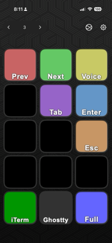

# Stream Deck Igor Vibe

> "In the future we'll just need keyboards with two buttons: yes or no."

Turns out while vibecoding, I've basically been doing that (on steroids). So I decided to make this tool.

A Stream Deck plugin for Igor's workflow - tmux pane navigation, voice activation, and utility keys.



## Features

| Action | Description | Shortcut |
|--------|-------------|----------|
| **Previous Pane** | Switch to previous tmux pane | `Ctrl+A`, `p` |
| **Next Pane** | Switch to next tmux pane | `Ctrl+A`, `n` |
| **Voice** | Activate Wispr Flow | Right Cmd + Right Shift |
| **Enter** | Press Enter key | `Enter` |
| **Tab** | Press Tab key | `Tab` |
| **Escape** | Press Escape key | `Esc` |
| **Ctrl+C** | Send interrupt signal | `Ctrl+C` |
| **Ghostty** | Open Ghostty terminal | - |
| **iTerm** | Open iTerm terminal | - |
| **Fullscreen** | Toggle fullscreen | `Option+Enter` |
| **Reload** | Hot-reload actions without restart | - |

## Requirements

- macOS 10.15+
- Stream Deck Software 6.0+
- [uv](https://docs.astral.sh/uv/) (Python package manager)
- Accessibility permissions for System Events

## Installation

1. Clone the repository:
   ```bash
   git clone https://github.com/idvorkin/streamdeck-igor-vibe.git
   cd streamdeck-igor-vibe
   ```

2. Symlink the plugin to Stream Deck:
   ```bash
   ln -sf "$(pwd)/com.igor.vibe.sdPlugin" ~/Library/Application\ Support/com.elgato.StreamDeck/Plugins/
   ```

3. Restart Stream Deck:
   ```bash
   just restart
   ```

4. Grant accessibility permissions when prompted (System Settings > Privacy & Security > Accessibility)

## Usage

1. Open Stream Deck software
2. Find "Igor Vibe" in the Custom category
3. Drag actions to your Stream Deck

## Development

### Run tests

```bash
just test
```

### View plugin logs

```bash
just plugin-logs      # Show recent logs
just watch-logs       # Watch logs in real-time
```

Logs are written to `/tmp/igor-vibe-code/plugin.log`

### CLI tool

The `keys.py` CLI can be used for testing:

```bash
./keys.py --help
./keys.py previous-pane
./keys.py next-pane
./keys.py voice
./keys.py custom x --control --shift
```

### Hot-reload workflow

When editing `actions.py`:
1. Make your changes
2. Press the **Reload** button on your Stream Deck
3. Changes take effect immediately

No restart needed for action changes!

### When to restart Stream Deck

**No restart needed:**
- Editing `actions.py` (use Reload button)

**Restart needed (`just restart`):**
- Editing `plugin.py`
- Adding/removing actions in `manifest.json`
- Changing action UUIDs, names, or icons
- Plugin crashes

### Reset plugin

If the plugin gets into a bad state:

```bash
just reset
```

This removes the symlink, restarts Stream Deck, and re-links.

## Project Structure

```
streamdeck-igor-vibe/
├── com.igor.vibe.sdPlugin/     # Stream Deck plugin
│   ├── manifest.json           # Plugin metadata and action definitions
│   ├── plugin.py               # WebSocket handler (restart required)
│   ├── plugin.sh               # Entry point script
│   ├── actions.py              # Action handlers (hot-reloadable)
│   └── icons/                  # Action icons
├── keys.py                     # CLI tool for testing
├── tests/                      # Test suite
├── justfile                    # Task runner commands
└── CLAUDE.md                   # AI assistant instructions
```

## Technical Notes

### Voice activation

The Voice action sends Right Command + Right Shift using macOS CGEvent at the HID level. This is required for compatibility with Wispr Flow (which uses Karabiner). Regular AppleScript keystrokes don't work because Karabiner intercepts at a lower level.

### Tmux pane navigation

The pane commands send tmux prefix sequences:
- Previous: `Ctrl+A` then `p`
- Next: `Ctrl+A` then `n`

Configure your tmux prefix in `actions.py` if different.

## License

MIT
